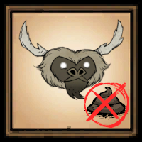

*Beefalo no longer poop **while being ridden*** since [release 445759][445759] on December 17 of 2020.

Beefalo's poop disappears after 5 seconds when bound with [Beefalo Gloom Bell][bell_wiki], which is added in [release 631099][631099] on September 12 of 2024.

If poops still bother you, feel free to use this mod.

# Beefalo Saddled No Poop

This is a mod for Klei's game [Don't Starve Together][dst], it prevents **saddled** beefalo from pooping around.

## How to Get This Mod

- Subscribe on [Steam][steam]
- Download from [GitHub][github]

[445759]: https://forums.kleientertainment.com/game-updates/dst/445759-r1389/ "445759 - Don't Starve Together - Klei Entertainment Forums"

[631099]: https://forums.kleientertainment.com/game-updates/dst/631099-r2391/ "631099 - Don't Starve Together - Klei Entertainment Forums"

[bell_wiki]: https://dontstarve.wiki.gg/wiki/Beefalo_Gloom_Bell "Beefalo Gloom Bell - Don't Starve Wiki"

[dst]: https://klei.com/games/dont-starve-together "Don't Starve Together | Klei Entertainment"

[steam]: https://steamcommunity.com/sharedfiles/filedetails/?id=1769805475 "Steam Workshop :: Beefalo Tamed No Poop"

[github]: https://github.com/liolok/BeefaloTamedNoPoop/releases "Releases · liolok/BeefaloTamedNoPoop"
